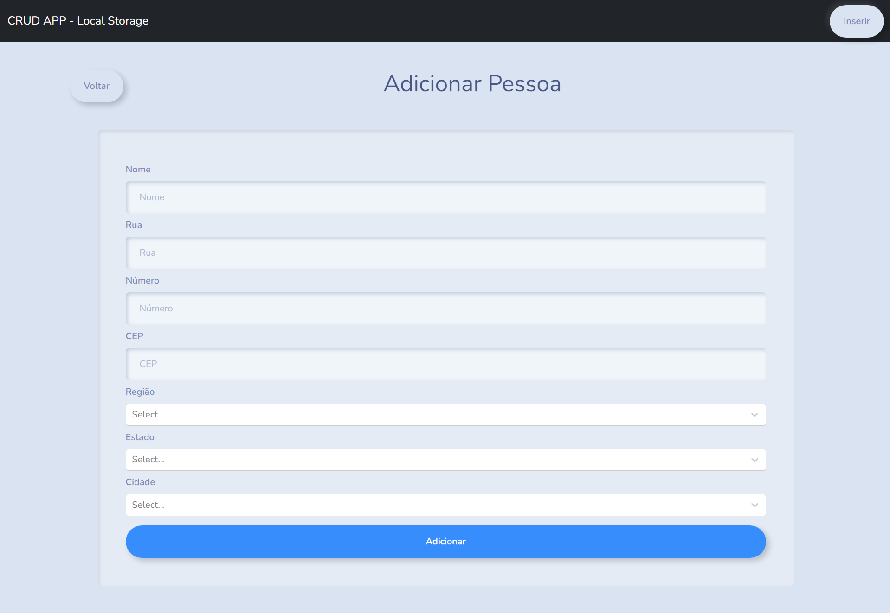
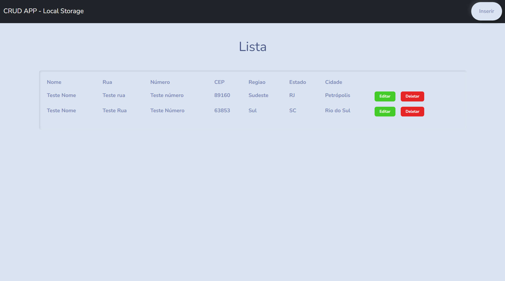

# crud-local-storage-react
DEPLOY: **http://lucasdebeterco.github.io/crud-local-storage-react**

Criar um formulário utilizando JS e salvando os dados no localStorage

Formulário deve conter os seguintes campos:
* Nome
* Rua
* Número
* CEP
* Região (combobox)
* UF (combobox) 
* Município (combobox)
 

Informações devem ser armazenadas em um objeto.

As opções para serem listadas em região, UF e município devem ser listadas de um array definido inicialmente no código.

Criar um menu de navegação na página para navegar entre a listagem e cadastro.

Ao escolher uma região, deve-se filtrar os campos de UF e município, para apresentar somente aquelas informações da região escolhida.

Ao escolher uma UF, deve-se filtrar os municípios para apresentar somente aqueles relacionados à UF escolhida.

 

Tela do formulário de cadastro.

  

 

Tela listagem das pessoas cadastradas.

  

